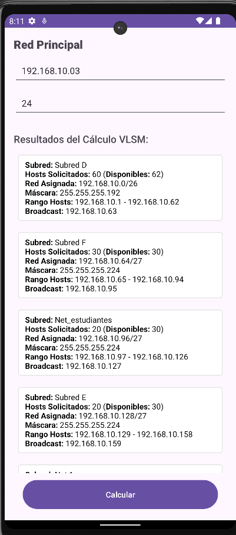

# Calculadora VLSM

## Pantallas de Entrada

### 1. Pantalla Inicial

### 2. Validación de Formato de IP (Formato Incorrecto)

### 3. Actualización de Subredes

### 4. Pantalla de Subredes Requeridas

### 5. Error de Espacio Insuficiente

### 6. Subredes Requeridas (Sin Rellenar)

### 7. Formato de Red Incorrecto

## Resultados del Cálculo VLSM

### 1. Resultados de Subredes

### 2. Resultados Detallados

### 3. Botón de Nuevo Cálculo

## Funcionalidad

- **btnActualizar:** Después de realizar las validaciones, se utiliza para actualizar los datos y recalcular las subredes.
- **btnNuevoCalculo:** Aparece al final, después de mostrar los resultados, para realizar un nuevo cálculo de subredes.
